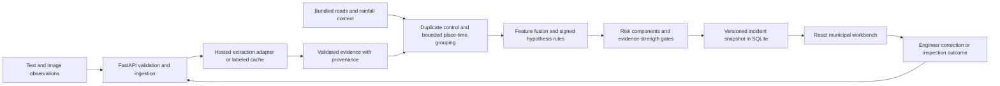

# Converge — Product + Architecture Freeze

**Team:** Control Alt Delete · **Track:** Smart Cities · **Version:** 1.1, approved for implementation · **Date:** 6 September 2026

**Verdict: MODIFY the implementation scope, then GO. Preserve the accepted concept.** Build a municipal inspection workbench that connects nearby water and road observations, explains competing interpretations, and makes inspection priority auditable. Do not attempt a trained infrastructure-failure predictor in this hackathon.

**Approval status: APPROVED FOR IMPLEMENTATION.** Ahmed has authorized Phase 1: foundation and the first offline structured-input vertical slice. Numerical thresholds below are prototype settings, not validated municipal standards or measured results. Phase 2 requires a separate instruction.

The supplied [event page](https://impactx-2026.vercel.app/#about) confirms a **24-hour on-site event, September 9–10, 2026, ECU Nasr City Campus**, and a Smart Cities track. Acceptance is supplied by the team. **Pre-build policy: confirmed allowed by organizers**, as explicitly relayed by Ahmed. Pre-event implementation is authorized now; permission is not an unresolved dependency. Plan against 24 on-site hours, not two full working days. No organizer contact is initiated here.

The event, technology capabilities, and source limitations cited below are externally supported. The proposed algorithms, scores, interface, estimates, and gates are our design decisions. No source establishes that this prototype can diagnose drainage faults or forecast infrastructure failure.

## 1. Final product definition

**Converge converts scattered infrastructure observations into explainable candidate incidents and a prioritized field-inspection queue.** Its first scenario is water accumulation co-occurring with visible road deterioration in one small urban area.

The primary user is a municipal duty engineer deciding **where to investigate next, which observations justify that choice, and what the inspection should distinguish**. The output is a candidate incident with linked observations, ranked working hypotheses, an impact-based risk index, evidence strength, missing information, and an inspection checklist.

The defensible promise is earlier recognition of a pattern **after weak observations appear**, relative to reviewing reports individually. It is not prediction before any observable evidence, a quantified warning lead time, proof of causation, or automated dispatch. A photo of damaged asphalt shows a condition; without comparable earlier evidence it does not establish worsening or water-caused damage.

The differentiator is operational: “This location deserves investigation because independent observations converge here, even though another location has more complaints.” Novelty of every underlying algorithm is neither required nor claimed.

## 2. Exact MVP boundary

| Dimension | Frozen proposal |
|---|---|
| Area | One approximately 2 km × 2 km Nasr City study area; provisional box latitude 30.045–30.063, longitude 31.325–31.346. This is a demo extent, not an administrative boundary or verified campus location. |
| Scenario | Water accumulation with nearby road surface deterioration; isolated water/damage remains visible as a watch item. |
| Inputs | Four families: bilingual text observations, still images, hourly rainfall context, and road/geographic context. GPS/time are observation metadata, not extra independent sources. |
| Data volume | Up to 1,000 observation records per demo dataset, no more than 500 active at a time, 50 displayed candidates, 30 bundled images. Reject oversized imports clearly. |
| User surface | One desktop municipal workbench, one incident drawer, a small observation entry panel, and replay controls. |
| AI | One hosted pretrained multimodal model for extraction; no custom training. |
| Core intelligence | Deterministic duplicate handling, bounded spatial/temporal grouping, signed evidence rules, risk components, uncertainty handling. |
| Operating modes | Connected extraction; cached-extraction replay; explicit manual structured entry when disconnected. Each mode is labeled. |
| Human action | Review, correct an observation, mark inspection needed, record an inspection result. No external dispatch. |
| Context excluded from scoring | Elevation and historical incidents in P0. They are optional later, not prerequisites for a convincing four-family pipeline. |

Why only four families: every additional source needs acquisition, provenance, freshness logic, missing-data behavior, and tests. A fifth source that cannot affect a defensible decision is decoration.

## 3. User workflow

1. The engineer opens the queue and sees separate watch items and candidate incidents, with the current data mode and clock.
2. A report or field image arrives through the entry panel or a prepared replay. The UI shows extraction pending; unprocessed content cannot silently affect scores.
3. Validated observations are grouped by place and time. The queue changes only after a complete scoring revision is committed.
4. The engineer opens a candidate: what was observed, which captures are independent, why the location was grouped, competing hypotheses, risk components, and uncertainty.
5. The engineer checks the originals and can correct an extraction. Correction creates a revision and recomputes the incident; it does not rewrite the raw source.
6. The engineer marks an inspection needed and receives a short checklist: verify standing water/obstruction, inspect visible drainage access if safe, document road condition, and look for an identifiable non-rainfall water source.
7. A later field result can confirm an observed condition, contradict it, or leave the cause unresolved. Only the engineer closes or dismisses the incident.

Success means a better-supported inspection choice. It does not mean that the software assigned a repair crew or confirmed a pipe failure.

## 4. Killer demo sequence

Target **three minutes**, adaptable once the organizer supplies pitch timing. Use three locations within the study area and a conspicuous “Synthetic incident replay on real road geography” badge.

| Time | What judges see | What it proves |
|---|---|---|
| 0:00–0:25 | Location A has eight copies of one water report. They collapse into one capture group and remain a watch item. | Complaint volume is not corroboration. |
| 0:25–0:55 | At location B, one Arabic report, an independently captured road image, and a later water observation appear on the same short road section. | Actual text/image extraction feeds spatial and temporal grouping. |
| 0:55–1:20 | A candidate forms. The map highlights contributing observations; its timeline spans the observed persistence. Location C, on another road or outside the window, stays separate. | Correlation has explicit boundaries. |
| 1:20–1:50 | Rainfall context is attached once. Three interpretations receive evidence-support scores; the detail panel shows the exact contributions. | Context changes interpretation without becoming another eyewitness. |
| 1:50–2:15 | B moves into the inspection queue with a component-based risk index and “Moderate evidence; cause unverified.” | Priority is driven by the observed hazard and exposure. |
| 2:15–2:40 | “Hide image evidence” recomputes a sandbox comparison: the damage component becomes unknown and the risk range widens. Restore it; then add duplicates and show no score increase. | The engine is responsive to evidence, not hardcoded to a script. |
| 2:40–3:00 | Mark inspection needed; show the checks that distinguish transient runoff from persistent ponding or a non-rainfall source. | A practical human decision closes the loop. |

Have one prepared ambiguous image and one new Arabic paraphrase for a connected demonstration after the main sequence. Never make a successful live cloud call a prerequisite for completing the pitch. Cached replay must contain actual previously obtained extraction outputs with hashes and model versions; hand-authored fixtures must be labeled as such.

Do not claim an actual Nasr City flood occurred on the fictional replay date. If event rules require live inference, cached replay alone will not satisfy that requirement.

## 5. System architecture

**Stack:** Python 3.11, FastAPI, Pydantic, standard SQLite access, Pillow for image normalization, React + TypeScript + Vite, MapLibre GL JS, plain CSS or one familiar lightweight component set. One backend process; no service decomposition. Pin package versions in the implementation phase after one smoke test.

Choose Vite rather than Next.js because this private client workbench needs no server rendering or search indexing. Choose SQLite because storage is local and writes are small and serialized; this fits SQLite's documented [local application use](https://www.sqlite.org/whentouse.html). Choose locally bundled GeoJSON roads and labels for a small offline map; MapLibre supports [GeoJSON layers](https://maplibre.org/maplibre-gl-js/docs/examples/geojson-markers/).

No Redis, Kafka, Celery, vector database, Kubernetes, GPU server, managed authentication, or mandatory Docker/WSL. Avoid making setup consume the build sprint. This is a local demonstrator, not a deployable municipal service.

## 6. AI architecture

Use **pretrained multimodal perception plus deterministic decision support**.

| Layer | Method | Source of intelligence | Boundary |
|---|---|---|---|
| Text understanding | Structured extraction of Arabic/English observations | Pretrained model; a team-reviewed extraction rubric | Does not establish whether a reporter is truthful. |
| Image understanding | Coarse visible-condition tagging with unknown states | Same pretrained model, image-only task | Does not infer underground faults, water depth, or deterioration rate. |
| Correlation | Explicit place/time and duplicate rules | Geometry, timestamps, capture lineage | Does not establish shared physical cause. |
| Hypothesis ranking | Signed compatibility rules over validated features | Versioned team-authored rule table | Not a learned posterior or a diagnostic probability. |
| Risk and evidence strength | Transparent components and quality gates | Observation values and documented heuristics | Not calibrated loss, failure likelihood, or operational SLA. |
| Explanation | Deterministic templates with evidence references | Stored scoring trace | Cannot add facts. |

The hosted extraction decision is **OpenAI behind a provider adapter**, configured only through server-side environment variables: `OPENAI_API_KEY`, primary `OPENAI_PRIMARY_MODEL=gpt-5.6-luna`, fallback `OPENAI_FALLBACK_MODEL=gpt-5.6-terra`. These are the requested target model identifiers; account access and extraction suitability will be tested in Phase 2. API models perform **structured perception/extraction only**. Local deterministic logic performs **incident intelligence**: independence, correlation, candidate formation, hypotheses, inspection-triage risk, evidence strength, and explanation traces. Phase 1 makes no API calls and has no extraction adapter implementation.

Use the primary for normal bounded extraction. Invoke the fallback only after schema-validation failure, material ambiguity within an allowed extraction, or explicitly requested manual re-analysis; never send every input to both. Cache validated extractions using the content hash, extraction task version, prompt version, schema version, and complete model configuration. Identical keys cause no new call. Never expose the API key to the frontend or commit `.env`. `.env.example` contains an empty API key and the explicitly requested model defaults, with no secrets.

The system remains functional from validated structured evidence with the model disconnected. New unstructured inputs then require a manual review; the product must not pretend they were analyzed automatically.

## 7. Exact responsibility of the LLM

**P0 responsibilities:** read a short report; identify language; extract affirmative, negated, or uncertain statements about standing water, visible road damage, passage obstruction, and reported duration; preserve a short original-language evidence span. Resolve a relative time only against a supplied timestamp, recording that it was inferred. Unknown time remains unknown.

Accept GPS from the user/fixture; do not invent coordinates from a landmark. Preserve reporter speculation such as “a pipe burst” as `reported_explanation`, excluded from scored factual features unless a subsequent inspection verifies the observation that supports it. Instructions embedded in a report or image are data, never tool commands.

One extraction request per new text record; one separate request per unique image. The image request gets the image and field rubric, not the surrounding complaint narrative, to reduce confirmation bias. Text and image from the same capture still count as one capture group.

Schema validation, length limits, and allowed enums run outside the model. Reject invalid/unsupported outputs to review; at most one retry. No model-generated risk, cluster membership, priority, independence, confidence percentage, or final incident label. No tool access, SQL generation, autonomous agent, or P0 chat interface.

Explanations are templates in P0. Optional LLM wording is P2 and must never replace the scoring trace.

## 8. Exact responsibility of computer vision

P0 uses the image-perception capability of the same hosted model; **there is no separate YOLO detector**. Tag only `standing_water`, `visible_surface_damage`, and `passage_obstruction`, each as `present / absent / uncertain / not_assessable`. Add a brief description of what is visible and `image_quality = usable / limited / unusable`.

“Absent” is allowed only when the relevant area is sufficiently visible. Glare, darkness, water covering the asphalt, an unrelated scene, or severe compression must produce uncertainty or not assessable. A photo containing water cannot establish the depth of a hidden pothole. An image alone does not authenticate its date or location.

Use Pillow for decoding, EXIF orientation, size limits, a SHA-256 hash, and a simple perceptual-hash duplicate flag. Limit uploads to JPEG/PNG, 5 MB and 12 megapixels; normalize to at most 1,280 pixels on the long edge. If resizing makes a detail ambiguous, abstain. Do not draw unverified bounding boxes or imply pixel segmentation.

Do not train a detector in the sprint. [RDD2022](https://arxiv.org/abs/2209.08538) provides road-damage imagery across six countries, but that does not supply local water/drainage incident outcomes or validate an Egyptian deployment. It is a possible later benchmark, not a ready-made Converge predictor. The P0 image acceptance gate is in §24.

## 9. Exact responsibility of conventional ML

**No supervised conventional ML model in P0.** There are no verified local incident labels, sufficient negative examples, or measured inspection outcomes to justify XGBoost, LightGBM, a random forest, or probability calibration.

Spatial grouping and weighted rules are algorithms; describe them accurately rather than calling them a trained ML model. Synthetic outcomes generated from our own rules cannot establish predictive accuracy for those rules.

After a municipal pilot, conventional ML could learn an inspection-priority ranker from adjudicated outcomes, compared against the same transparent baseline. That requires leakage-safe geographical/temporal splits and a defined operational target. It is outside this build. Adding a token classifier simply to display another model name weakens the technical story.

## 10. Signal schema

One signal is an acquired source record. An extraction may produce multiple evidence items, without producing multiple independent witnesses.

| Field group | Required content |
|---|---|
| Identity | `signal_id`, `schema_version`, `dataset_id`, `source_family`, `source_record_id`, idempotency key |
| Provenance | source URI/file reference, source organization/author category, license/permission, acquisition time, raw content hash |
| Reality status | `content_origin = collected / public_source / synthetic`; `placement_origin = original / simulated / unknown`; `time_origin = original / simulated / inferred / unknown` |
| Location | WGS84 `lat`, `lon`, `location_accuracy_m`, `location_method`, nullable `road_context_id` |
| Time | `observed_at`, `received_at`, `available_at`, timezone origin, time precision/uncertainty; UTC storage |
| Lineage | `capture_group_id`, pseudonymous source identity when available, `duplicate_of`, `duplicate_status` |
| Payload | text or local image reference; for context, variable, unit, value, footprint and validity interval |
| Processing | `pending / extracted / needs_review / failed`, extraction method, provider/model/prompt version, processing time |
| Review | reviewer role, correction revision, reason, timestamp; never overwrite the original payload |

Unknown fields are null, not zero. Context records carry their spatial footprint and period, not an invented eyewitness coordinate. Do not retain names, phone numbers, or image EXIF in the client; retain only needed time/location metadata in the local record. API credentials remain server-side.

## 11. Incident schema

| Field group | Content |
|---|---|
| Identity | `incident_id`, `dataset_id`, `revision`, `algorithm_version`, `config_version` |
| Geometry | member coordinates, medoid, bounding box, road-context IDs, maximum member distance |
| Time | first/last observed time, last evidence ingestion, `computed_as_of`, active/stale flag |
| Formation | `watch / candidate`, qualifying capture groups, membership reasons and exclusions |
| Evidence | evidence IDs, member signal IDs, independent-group count, source families, shared-context IDs |
| Outputs | ranked hypothesis support points and contributions; component-based risk interval/band; evidence-strength tier; missing/conflicting fields |
| Action | proposed inspection checks and supporting rule IDs |
| Human state | `unreviewed / inspection_needed / inspected / dismissed / closed`, note and recorded outcome |
| Audit | previous revision, lineage for regrouping, extraction modes, provenance summary |

No `failure_probability`, `root_cause_confirmed_by_ai`, or fabricated cost estimate. Lifecycle and analytical status are separate: aging evidence does not close an engineer's incident.

## 12. Evidence representation

Each evidence item stores `evidence_id`, `signal_id`, `capture_group_id`, `feature`, `state`, optional ordinal value/unit, source span or image reference, observation time, extraction provenance, review status, quality weight and reasons. Each hypothesis contribution stores its `rule_id`, signed weight, feature strength, resulting points, and contributing evidence IDs.

Keep four distinct statements visible: **reported** by a person, **visually suggested** by a model, **verified** by a reviewer/field result, and **derived** by a rule. A model's fluently expressed explanation cannot upgrade one category into another.

Proposed evidence weights, used as conservative heuristic multipliers, not probabilities:

- 0.9: reviewed observation with adequate place/time and clear evidence.
- 0.7: usable automatic extraction with adequate supplied metadata.
- 0.4: ambiguous extraction, poor metadata, or limited image; displayed but below the 0.5 scoring-admission gate.
- 0: unusable, unlocated, untimed for correlation, invalid, or not assessable.

Apply the lowest applicable quality category. Admission requires the base quality weight `q ≥ 0.5`; apply recency decay only after admission, without treating the decayed value as another admission threshold. A real photo placed at a fictional demo location can receive a reviewed weight **inside a simulated run**, while retaining both provenance labels; it supplies no real-world incident evidence. Production and demo datasets cannot share a scoring run.

Duplicate logic first uses source idempotency, then exact image hashes and normalized text hashes with copy lineage. Identical generic text from different places or independently documented authors is not automatically a duplicate; require a common source/copy lineage or flag uncertain dependence for review. An exact reused photo cannot supply a new independent visual capture, and conflicting claimed locations/times require review. A perceptual-hash match or a same-author repeated report is a potential dependency, not proof of identity. Flag it for review and conservatively prevent extra corroboration until resolved. Independent capture is asserted from recorded provenance; ten accounts or ten modalities do not guarantee ten independent events.

## 13. Spatial correlation method

Use direct Haversine distance in meters on validated GPS, plus a small **road-context compatibility table**. Do not cluster raw latitude/longitude degrees with an unscaled timestamp.

Proposed maximum pair distance is **120 m**. Every admitted observation must be within 120 m of **every** other member, not merely linked by a chain. The road context must also be compatible: same mapped short road section or an explicitly allowed adjacent section at a mapped junction. Ten to twenty reviewed road-context segments are sufficient for this study area; do not build routing or sewer-network inference.

Assign a road context to a point only when its nearest segment is within 30 m and no competing incompatible segment is within 10 m of that nearest distance. Otherwise flag an ambiguous assignment for manual review. GPS accuracy worse than 50 m or unknown accuracy blocks automatic corroboration; retain the observation for review.

The 120/30/10/50 m thresholds are prototype configuration. Evaluate parallel roads, opposite sides of a barrier, intersections, inaccurate pins, and 119/121 m boundary cases. Do not expand the radius to absorb bad GPS. Geometry supports proximity, not drainage connectivity.

Why not plain DBSCAN: density reachability can connect a chain longer than the intended incident footprint; its `eps` is not a cluster-diameter bound. The [scikit-learn clustering documentation](https://scikit-learn.org/stable/modules/clustering.html) describes the density-based method. A small explicit grouping routine is easier to constrain and explain here.

## 14. Temporal correlation method

Store UTC; display `Africa/Cairo` using timezone-aware conversion. Use observation time for incident membership and availability/ingestion time for what the system could know. Never equate a late upload with a fresh capture.

At analysis clock `t`, candidates use observations from the trailing **6 hours**, with pairwise event-time differences no greater than 6 hours, and only records whose `available_at ≤ t`. Observations with time uncertainty greater than 30 minutes require review before automatic grouping. Future-dated records beyond a 5-minute clock tolerance are quarantined; within the tolerance, treat their effective age as zero and flag clock skew. Exact boundary membership is inclusive and tested. In synthetic replay, availability follows the declared simulated ingestion schedule; preserve original acquisition timestamps separately. A complete fixture file must not reveal its later observations before their scheduled availability.

Observation recency weight is `f(age) = 2^(-age_hours / 6)`, for admitted ages 0–6 hours. Older records remain in the audit/history; an incident loses its active indicator when it no longer has qualifying current evidence, without being auto-resolved. Long-running episodes beyond this MVP window need engineer linkage, not a hidden auto-merge.

Rainfall uses the completed preceding 6-hour interval, with explicit missing-hour checks. The replay clock is synthetic and shown in the UI. True historical availability is required for any future lead-time evaluation; reanalysis replay alone is not an as-issued forecast test.

## 15. Candidate incident formation strategy

1. Select eligible observation signals in the current dataset and time window. Keep contextual weather/roads out of the member count.
2. Collapse duplicate capture groups. A group can carry water and damage facts but counts once for corroboration; internal place/time inconsistency requires review.
3. Sort by observation time and stable signal ID. Start with the earliest unassigned group; add subsequent groups only when all spatial, temporal, and road-compatibility constraints hold against every current member.
4. Where multiple groups are eligible, choose the cluster with the smallest maximum pair distance, then earliest seed ID. No chaining or automatic bridge-merging. This deterministic greedy partition may split a real event; expose that limitation.
5. One qualifying capture group is a **watch item**. Two or more distinct eligible groups with at least one water observation form a **candidate**. A candidate is tagged “water + road condition” only when admitted water and damage evidence are both present. Multiple text groups can form a candidate, but are not presented as multimodal corroboration.
6. Attach rainfall once per relevant footprint/window and road context once per applicable feature. These cannot form a candidate by themselves.
7. Recompute features and outputs. Match new memberships to prior incidents by greatest capture-group Jaccard overlap of at least 0.5, one-to-one; break ties by stable ID. Otherwise create a new ID and record regrouping lineage. Never silently copy a human resolution to a differently grouped candidate.

This is implementable as pure Python over hundreds of records. Broad grouping can be quadratic; profile the bounded dataset rather than introducing spatial infrastructure prematurely.

## 16. Multimodal fusion strategy

**Late fusion over explicit features**, not concatenating every source into an LLM prompt.

For an observed Boolean feature, evidence strength is `q × f(age)`. Within and across capture groups, use the maximum qualifying support, not a sum. Count independent captures separately for candidate/evidence-strength gates. This avoids rewarding repeated wording or counting one image as several independent confirmations.

Maintain positive and negative evidence separately. Two qualifying incompatible observations of the same place/time feature yield a conflict: omit that feature from scoring and expose both. A clear later change is a temporal update, not a contradiction; retain both in the timeline. Evidence absence is never negative evidence.

Derived persistence requires at least two qualifying water-positive capture groups, separated by at least 2 hours and at most 6 hours, with no intervening clear negative observation. Its strength is the minimum strength of the two qualifying endpoints. “Still wet after rain” from one report is a reported claim, not automatically a measured series.

Weather uses one context strength of 0.6 when the chosen provider series is complete, valid for the area/time, and available for the run; otherwise it is missing. Multiple weather fields from one model do not add independent support. Road context affects exposure; it is not evidence of a drainage blockage.

All contributions include raw evidence lineage. Feature selection and weights are versioned in one small configuration table. Ablation disables a family before feature derivation, then reruns the same engine, including candidate gates; it does not edit displayed numbers.

## 17. Risk model strategy

Display **“Risk index — inspection triage”**, explicitly an ordinal impact heuristic. Do not label it a probability, expected financial loss, or certified safety assessment.

`R = 100 × (0.35 W_extent + 0.30 D_condition + 0.20 P_duration + 0.15 E_exposure)`

| Component | 0 | 0.5 | 1 |
|---|---|---|---|
| Water extent | Explicitly no standing water at the relevant current location | Localized accumulation | Clearly reported/visible lane or walkway obstruction by water |
| Road condition | Relevant surface visible and explicitly intact | Visible damage, extent/severity unclear | Clear broken/open surface or substantial passage obstruction; no inferred depth |
| Persistence | Verified transient/resolved within 30 min | Two positive captures 30 min to under 2 h apart | Two positive captures 2–6 h apart |
| Exposure | Known service-only/access-restricted context | Known local street | Road tagged primary/secondary/tertiary in the reviewed context map |

Unobserved, obscured, contradictory, or inadequately located components are **unknown**. A single report does not establish zero persistence. For each component, use the maximum admitted current ordinal value across members after conflict handling and superseding older observations of the same feature/location; do not sum reports or multiply severity by witness count. Road class is a proxy, not measured traffic or vulnerability. Do not infer hospitals, traffic volumes, or population affected from an empty map.

For unknown components, calculate `R_min` with their values at 0 and `R_max` with their values at 1. Display the range and known-component coverage. Do not renormalize remaining weights upward. If all components are known, display one rounded value. Rainfall affects hypotheses, not this impact index; it should not mechanically make observed road damage more severe.

Proposed bands: under 35 watch, 35–under 65 inspect, 65+ inspect first. A range crossing a band is provisional. Candidate queue order: explicit substantial-obstruction observations needing urgent human review first, then descending `R_min`, then most recent evidence, then stable ID. Watch items appear separately; severe single reports remain visible for immediate verification. Uncertainty is displayed rather than multiplied into risk to hide potentially consequential weak reports. Upper bounds do not independently trigger high-risk alerts.

Worked example: localized water 0.5, visible damage 0.5, persistence 1, higher-class road exposure 1 gives **67.5**, displayed as **68/100, inspect first**. If only the damage evidence is removed, the range becomes **52.5–82.5**, displayed with outward rounding as **52–83, provisional**. Use unrounded values for bands and sorting. These are illustrative calculations, not observed test results.

## 18. Confidence / uncertainty strategy

Use **evidence strength**, not an “87% confident” badge. Keep three uncertainties separate: observation quality, cluster linkage, and explanation ambiguity. Root cause remains unverified until an adequate field outcome exists.

| Tier | Proposed gate |
|---|---|
| Limited | Fewer than two eligible capture groups, only one observation modality, unresolved place/time quality, or a material contradiction. |
| Moderate | At least two eligible capture groups; both text and image observation evidence; usable time/location; no unresolved material conflict. Weather does not satisfy the image/text gate. |
| Strong corroboration | Moderate conditions plus at least three eligible capture groups, a human field-verification record, and temporal corroboration. This describes evidence agreement, not confidence in a physical cause. |

Automated-only runs are capped at Moderate. Define material conflict as one affecting water presence, road condition, obstruction, or membership; such a conflict caps the incident at Limited and makes affected risk components unknown. A low-quality item already excluded from scoring remains visible but does not overturn strong evidence merely by existing.

Show missing rainfall, uncertain capture time, unverified location, and unknown damage separately. Show risk intervals (§17), hypothesis score gaps (§19), and number of independent captures. No Bayesian posterior, conformal interval, entropy percentage, or statistical calibration claim is justified by the available data.

## 19. Ranked hypothesis strategy

Use three **working interpretations**, which can coexist:

- **H1:** Persistent rainfall-associated ponding / possible drainage limitation.
- **H2:** Transient surface runoff or short-lived ponding.
- **H3:** Non-rainfall water source, such as irrigation, washing, or leakage; subtype unverified.

H1 must be worded “persistent ponding; rainfall relationship unknown” if rainfall evidence is missing. None of these titles asserts a blocked drain or broken pipe.

For feature strengths `x_j` between 0 and 1, compute `S_h = Σ w_hj × x_j`. Missing/conflicted features are omitted, never treated as false. These are **support points**, not probabilities; no softmax normalization.

| Qualifying feature | H1 | H2 | H3 |
|---|---:|---:|---:|
| W: standing water | +2 | +2 | +2 |
| D: visible road damage | +1 | 0 | 0 |
| P: repeated water over ≥2 h | +2 | −2 | +1 |
| R: modeled preceding-6-hour rain ≥5 mm | +2 | +2 | −1 |
| N: complete series with preceding-6-hour rain ≤0.2 mm | −1 | −1 | +2 |
| C: clear later observation of water receding/resolved | −2 | +2 | −1 |
| S: identifiable non-rainfall discharge recorded by field review | 0 | 0 | +2 |

R and N are mutually exclusive; intermediate rain gives neither. These thresholds are demonstration heuristics, not a meteorological definition of heavy rain. A coarse dry grid is not proof of a dry street. P and C cannot both characterize the same current period; a later resolution supersedes persistence for current scoring. Explanations must say road damage may be pre-existing and contributes only weakly to H1.

Rank by support points. Preserve ties within **1 support point** as “not distinguishable with current evidence”; stable hypothesis ID controls rendering order only. Show no leading explanation if water is unsupported, all scores are non-positive, or only the common W feature contributes. Still present the alternatives and missing discriminator.

Example feature strengths W=0.9, D=0.7, P=0.7, R=0.6 yield H1=**5.1**, H3=**1.9**, H2=**1.6**. H1 leads; H2/H3 are not meaningfully separated under the proposed margin. Removing R gives 3.9, 2.5, and 0.4. That is arithmetic sensitivity, not evidence of a validated causal model.

## 20. Explanation strategy

Render from the saved scoring trace, using this fixed sequence: **observed pattern → why these records were grouped → risk components → leading interpretation and alternatives → uncertainty → inspection discriminator**.

Example: “Two independent water captures and a separate road-condition image fall on compatible road sections within 120 m over three hours. Persistent ponding has the most support. Modeled rainfall is consistent with that interpretation, but drainage limitation is unverified and a non-rainfall source remains plausible. Inspect the water extent, nearby drainage access, and any visible discharge source.”

Every factual clause links to evidence IDs; every recommendation links to a rule. Weather wording includes “modeled,” reports say “reported,” and automated images say “image suggests” until reviewed. Do not invent a failure date, estimated savings, number of citizens affected, or confidence percentage. Engineer edits are recorded as human notes, not retroactively attributed to the model.

## 21. Data sources

| Source | Planned use | Limitation and fallback |
|---|---|---|
| Team-authored Egyptian Arabic, standard Arabic, and English reports | Extraction cases and replay observations | Synthetic citizen content; never presented as municipal complaints. Manual review is available. |
| Consented team photos, or clearly licensed public images with source manifest | Visible water, damaged road, clean road, ambiguous negatives | Do not assume a photograph's original place/time. A relocated public image is explicitly simulated evidence. Use fewer properly sourced images rather than scraped imagery of unknown rights. |
| [Open-Meteo historical weather](https://open-meteo.com/en/docs/historical-weather-api) | Small cached rainfall series for a past-time context example | Reanalysis/model data is not a street rain gauge and may not have been available at event time. On failure, rainfall is unknown or explicitly synthetic. |
| [OpenStreetMap](https://www.openstreetmap.org/copyright) | Road geometry, road classes, labels, selected geographic context | Completeness and positional accuracy vary. Attribute OpenStreetMap contributors and retain the source/date and applicable ODbL terms. Manual road compatibility review is required. |
| Municipal historical outcomes | None supplied; not a P0 dependency | No invented incident history presented as real. Add only after obtaining an authorized, documented source. |
| [Copernicus DEM](https://dataspace.copernicus.eu/explore-data/data-collections/copernicus-contributing-missions/collections-description/COP-DEM) | Later broad terrain context only | This is a surface model including structures/vegetation; GLO-30 is coarse relative to drains. Do not infer drainage direction, inlet capacity, or street depressions from it in P0. |

Open-Meteo documents kilometer-scale historical products and distinguishes reanalysis from forecast archives; choose one product and record its grid/valid time. Its documentation limits the free endpoint to non-commercial use; check the applicable terms before a municipal deployment. For P0, cache one small response, not a weather request per report. No claim of neighborhood-scale measured rainfall accuracy follows from entering precise coordinates.

Render the bundled road vectors against a locally defined map style. **Do not prefetch the public OSM tile server for an offline demo**: its [tile usage policy](https://operations.osmfoundation.org/policies/tiles/) prohibits that. A small vector road map avoids a live basemap dependency; bundle fonts/icons too.

## 22. Which data is real versus synthetic

Use provenance at the record level and a visible run-level badge.

| Asset | Honest designation |
|---|---|
| Downloaded road geometry | Real public geographic source; not a guarantee that the current road is unchanged. |
| Untampered archived weather response | Real provider output, modeled/reanalysis; not a physical sensor reading at the map pin. |
| Team-written reports | Synthetic reports. |
| A real photo assigned to a fictional location/time | Real image content with simulated placement/time. |
| Fictional rain burst for the three-minute story | Synthetic rainfall context, including its interval and units. |
| Generated incident identity and hidden scenario outcome | Synthetic scenario truth, inaccessible to the engine. |
| Cached AI extraction | Previously computed model output, with input hash/model/prompt/version; not fresh inference. |
| Human-entered feature values | Manual annotations, with reviewer provenance; not AI output. |

Recommended main demo: **real road geography + synthetic reports/time/rainfall + sourced images with explicit simulated placement**. This removes the temptation to invent a real contemporary storm or secretly align unrelated archive data. Separately demonstrate that the weather adapter can ingest an authentic cached response; adapter connectivity is not real-incident validation.

No verified local incident outcomes are currently available. Consequently there is no real-world predictive accuracy, root-cause accuracy, or measured early-warning lead time to report.

## 23. Dataset-generation plan

Preparation produces a small manifest and fixtures after approval and subject to event rules, not a large training corpus.

1. **Source manifest:** Adham records every image/source URL or capture record, permission/license, original metadata if known, simulated metadata, split, content hash, and reviewer. Farida checks that imagery is readable and text sounds natural.
2. **Text set: 60 reports.** Twenty Egyptian Arabic, twenty standard Arabic, twenty English; across them include negation, vague landmarks, old incidents, speculation, urgency language, duplicate paraphrases, and ordinary benign water use. Split 30 development / 30 locked test, grouped by originating scenario/template, with language balance in both.
3. **Image set: 24 distinct images.** Six water, six road damage, six intact/benign, six ambiguous/irrelevant. Use 12 development / 12 locked test with all categories represented. Two people independently label presence/absence/uncertainty; adjudicate disagreement before model evaluation. These are small smoke tests, not dataset-level performance evidence.
4. **Sequence set: 24 small scenarios, typically 5–10 records each.** Twelve development / twelve locked test: persistent ponding with damage, transient puddles, duplicate bursts, independent dry-road damage, possible non-rainfall water, nearby separate roads, uncertain timestamps, late ingestion, irrelevant/poor images, and missing context. Hold out whole story families and source images, including their paraphrases/crops, across splits.
5. **Scenario truth:** Adham writes expected grouping and acceptable inspection priorities before seeing engine results. Include “insufficient evidence” and multiple acceptable hypotheses. Store hidden scenario labels outside imported API payloads.
6. **Perturbations:** fixed seed for GPS/time jitter, missing context, shuffled import order, exact duplicates, repeated images, and contradictory observations. Parameters describe observations; never generate the target label by applying the scoring formula.
7. **Seal test fixtures:** Ahmed may tune only on development cases. If a test failure causes retuning, disclose the test as development and create a new held-out case; do not advertise a repaired score as untouched validation.

Use hand-authored templates with seeded variation; no LLM is required to generate hundreds of reports. Counterfactual tests must include high complaint counts without corroboration and high-consequence observations with little evidence. Measure the raw-extraction pipeline separately from the engine fed with reviewed features so good rules cannot conceal poor perception.

## 24. Evaluation metrics and acceptance gates

**All numbers below are release targets; no measurements exist yet.** A tiny synthetic test set supports a reliable demonstration, not municipal deployment claims. Report counts and denominators beside percentages, broken down by language and image class.

| Layer | Measurement | P0 gate / response to failure |
|---|---|---|
| Text extraction | Field precision/recall/F1 for water/damage/obstruction; negation errors; unsupported facts; time/location invention | At least 90% precision on asserted positive fields and macro F1 ≥0.80 on the 30 locked reports, with support counts. Zero invented coordinates and zero affirmative flips on the designated negation guard cases. Failed fields become manual-only. |
| Image extraction | Present/absent precision and recall, per-class counts, abstention rate and coverage, ambiguity handling | At least 11 of 12 held-out images must have all assessed target tags correct; at least 8 must yield an assessable target tag. Ambiguous cases must abstain rather than fabricate. No invented depth/root-cause statements. On failure, downgrade the offending tag to reviewer-required; do not claim reliable automatic CV. |
| Duplicate control | Score/capture-count changes after 1 versus 10 exact copies, same photo attached to different reports, and near-duplicate review cases | Exact duplicates must change neither independent count nor feature scores. Near duplicates must be flagged and cannot add corroboration until reviewed. |
| Clustering | Pairwise precision/recall/F1 over capture-group pairs; incorrect merge/split counts; boundary cases | Zero merges in designated barrier, 121 m and >6 h negative guards. Target pairwise precision ≥0.90 and recall ≥0.80 on the locked sequence set; list every failure. |
| Hypotheses | Agreement with adjudicated acceptable sets, appropriate abstention/ties, contribution trace | On every insufficient-evidence guard, abstain; keep acceptable alternatives visible. At least 10/12 locked scenarios place an acceptable working interpretation in the leading/tied set. Do not compare with unknowable real root cause. |
| Risk | Hand-calculated formula fixtures, unknown ranges, duplicate invariance, correct queue ordering | Exact arithmetic within rounding tolerance; missing components widen bounds correctly. No score increase from repeated copies. |
| Ranking usefulness | Top-1 choice agreement and NDCG@3 against independently assigned ordinal inspection priorities | Report full fusion versus baselines. Target an improved first inspection choice in at least 3 of 4 predeclared convergence cases, without regression on benign/urgent-single guards. If absent, do not claim demonstrated fusion benefit. |
| End-to-end | Raw text/image → extraction → grouping → scoring → UI, plus identical run with reviewed features | Run all 12 locked scenarios in each mode; report extraction-induced errors separately. Cached mode uses genuine stored model output, not gold labels. |
| Robustness | Missing rain, disconnected model, invalid coordinates, conflicting updates, stale inputs, reset/restart | No crash; no silent zeros or fabricated inference; correct mode/data-health notice on every guard. |
| Explainability | Audit of factual claims and displayed contributions | Every displayed fact and number links to evidence or a rule; no unsupported causal statement. |
| UX | Adham and Farida independently choose a first inspection and identify one uncertainty | Both complete the prepared task in ≤45 seconds without Ahmed explaining the screen. Treat this as formative QA, not a municipal user study. |
| Reliability | 20 warm repetitions and 3 cold starts of the complete replay | No lost actions or failed replay; record p50/p95 and cold-start time against §30 targets. |

Baseline A is descending raw report count. Baseline B uses de-duplicated text-only evidence with the same impact components and unknown handling. Full fusion adds image and context. Ablations remove image, rainfall, and temporal persistence one at a time. Keep common risk rules and held-out scenarios fixed across comparisons.

Do not report ROC-AUC/Brier scores without a probabilistic target, statistical significance from twelve scenarios, or hours of warning gained from artificially scheduled reports. Sensitivity-check 80/120/160 m and 3/6/12 h on development cases; freeze the chosen defaults before running the locked tests.

## 25. Backend architecture

A modular monolith with six logical components: ingestion/validation, extraction adapter, evidence normalization, correlation, scoring/explanation, and incident/query endpoints. These are responsibilities, not six services or a mandate to generate dozens of files.

Pydantic validates all API and model outputs. A small SQLite job table records `queued / processing / complete / failed`. One in-process asynchronous task consumes jobs sequentially; cloud calls occur outside database transactions. On restart, abandoned processing jobs become queued, and cache keys prevent duplicate inference where a completed response exists. An uncertain remote completion can still cause one repeated billed call; record attempts and enforce the request cap.

The cache key includes content hash, extraction task, model snapshot, prompt and schema versions. Store raw response and validated result. Recompute incidents locally from validated evidence; changing the risk rules does not call the model again.

Commit evidence, incident revision, hypothesis/risk trace, and processing status atomically after processing. Use optimistic `expected_revision` for human edits. Poll job/incident status once per second while processing; stop polling when settled. No WebSocket infrastructure is needed.

Keep the server bound to loopback for the demo. Use a runtime directory outside the OneDrive-synced project, proposed `%LOCALAPPDATA%\Converge\runtime`, for SQLite, jobs, and uploaded files; keep code and specifications in the workspace. Store reproducible fixtures separately from mutable state. Use short transactions and one serialized writer. Do not put a live SQLite file in a synchronized shared folder.

## 26. Frontend/dashboard information architecture

Use one 1440×900 desktop composition, usable at 1280×720 without essential content disappearing.

| Area | Essential information / action |
|---|---|
| Top strip | Converge, study area, Live/Cached/Manual extraction mode, Synthetic/Mixed source badge, replay clock, data health. |
| Left queue | Candidate title, road/area, risk index/range, evidence tier, latest observation, review state; watch items in a separate collapsible section. |
| Center map | Road context, observation pins by family, candidate outline, clear selected state. No fabricated heatmap or sewer-network lines. |
| Right incident drawer | “Why inspect here?” summary, three working interpretations with support points, evidence tiles, risk breakdown, uncertainty, inspection checks. |
| Timeline | Observation-time order, available/ingested time on hover/detail, contributing captures, context interval, current replay position. |
| Small tools panel | Add text/image with pin/time; correction form; replay reset; evidence-family ablation. These do not become separate product pages. |

Use color plus text/icons, with distinct visual treatments for risk and evidence strength. Evidence cards show “same capture,” “independent capture,” “modeled context,” and “manual” where relevant. Show original Arabic in properly directed text blocks; English operational UI is P0, full Arabic interface is P1.

The first screen must answer: where, why now, how well supported, what to check. Avoid a wall of charts, giant KPI counters, 3D city graphics, or animation that delays an action. Visually verify offline fonts, long Arabic text, missing thumbnails, ties, and empty states.

## 27. Database schema at a high level

| Table | Purpose / important relations |
|---|---|
| `datasets` | Run identity, mode, synthetic/mixed status, replay settings and clock. |
| `signals` | Raw text/context metadata, attachment reference, capture lineage, location/time/provenance; belongs to dataset. |
| `extractions` | Append-only attempts and validated results linked to signal; unique cache key where applicable. |
| `evidence` | Atomic features linked to signal/extraction and review revision. |
| `road_contexts` | Reviewed local road geometry, class, and compatible-neighbor IDs. |
| `incidents` | Stable identity and current human state. |
| `incident_revisions` | Analytical snapshot and configuration version; risk, hypotheses, evidence-strength and explanation trace stored as validated JSON. |
| `incident_members` | Revision-to-signal/capture membership with reasons. |
| `reviews` | Human correction, inspection state/outcome, expected/prior revision, note and time. |
| `jobs` | Persistent extraction status and bounded retry details. |

Use foreign keys, unique `(dataset_id, source_family, source_record_id)` where supplied, and indexes on dataset/time, job status and incident revision. Images are files, not base64 database blobs. JSON is acceptable for small fixed scoring traces; no need for separate tables for every hypothesis weight.

A later multi-user deployment may require a server database and geospatial indexing, authentication and an actual access model. None is required to prove the incident-intelligence loop locally.

## 28. API boundaries

All routes are under `/api/v1`; responses contain dataset ID, version and UTC timestamps. Client displays backend outputs and performs no duplicate scoring logic.

| Endpoint | Contract |
|---|---|
| `POST /signals` | Submit one text or typed field observation with pin/time/provenance and idempotency key; return signal ID and pending/ready status. |
| `POST /signals/{id}/image` | Attach bounded multipart image; inherit capture group unless independently captured with its own metadata; return job ID. |
| `GET /jobs/{id}` | Processing status, failure reason, result reference; never expose provider credentials. |
| `GET /incidents` | Filter by dataset, bounding box, active/review state; return ranked summary list. |
| `GET /incidents/{id}` | Current snapshot, evidence, hypothesis/risk trace, uncertainty and inspection checks. |
| `GET /signals/{id}` | Original payload and extraction provenance for drill-down. |
| `POST /signals/{id}/reviews` | Append a correction with expected revision; trigger local recomputation. |
| `POST /incidents/{id}/reviews` | Change human review state or record a field outcome; no external notification or dispatch. |
| `POST /demo/replay` | Start/reset/advance a named bundled demo in a demo-only namespace; cannot mutate another dataset. |
| `POST /demo/compare` | Recompute a transient ablation from a snapshot with disabled families; return differences without altering canonical evidence. |
| `GET /health` | Backend readiness, cache/model mode, context freshness, queue backlog; no sensitive config values. |

Use 202 for queued work, 422 for invalid data, 409 for stale review revisions, 413 for limits, and a clear 503 for unavailable new automatic extraction. Offline manual submission remains available. Provider outages do not return a successful fabricated extraction.

Weather and road imports use the same signal/validation boundary internally from bundled fixtures; there is no arbitrary URL-fetch API or generic municipal integration platform.

## 29. Local versus cloud model decisions

| Work | Location | Reason and fallback |
|---|---|---|
| Arabic/English extraction | Hosted compact model | Avoid local model deployment and dialect-training overhead. Cache successes; manual review when unavailable. |
| Image tagging | Same hosted model, separate task | Avoid finding/training a water-and-road checkpoint. Cache exact inputs; manual tags if gate fails. |
| Correlation, risk, hypotheses, explanations | Local CPU | Fast, deterministic, inspectable, and available offline. |
| SQLite, files, dashboard and road map | Local | Predictable demo without hosting or managed-service dependencies. |
| Weather | One cached provider response per applicable area/time slice, or labeled synthetic fixture | No network call per incident; missing context does not block observations. |

Use one concurrent provider request, at most one retry per item, an 8-second request timeout and a 20-second total job deadline. Only transient errors are retried; invalid credentials produce an immediate actionable error. Cache hits make no provider call. These are application bounds, not promised provider latency.

Proposed development spending ceiling: **US$10 and 250 extraction attempts**, whichever bound is reached first; record provider usage and stop automatic new calls at the configured cap. No calls or spending have been performed in this architecture phase. Confirm account/model access in the first implementation spike; do not spend hours swapping providers. A failed model gate means explicitly reduced automation, not hidden replacement with gold labels.

If event instructions disallow hosted models or demand locally trained AI, this architecture must be revisited before implementation. The public event page supplies no such requirement.

## 30. Performance constraints for Ahmed's laptop

These are engineering budgets to measure, not hardware benchmarks.

| Resource / operation | Target |
|---|---|
| Added app runtime memory | ≤2.5 GB across backend and a focused demo browser; watch total system memory and keep practical headroom below the 12 GB limit. |
| Model VRAM | No local model allocation; ordinary browser graphics may still use the GPU. |
| Backend workers | One. Replicated processes consume their own memory, as described in [FastAPI deployment guidance](https://fastapi.tiangolo.com/deployment/concepts/). |
| Active data | ≤500 observation records / ≤50 displayed candidates; ≤1,000 stored records in the loaded demo. |
| Image handling | One decode/extraction at a time; thumbnails in the queue, full image loaded on demand. |
| Local regroup + rescore | p95 <500 ms on the bounded dataset after validated features exist. |
| Incident detail | p95 <300 ms locally; smooth map interactions with no continuous rescoring loop. |
| Cached replay step | p95 <1 second from command to stable visible revision. |
| New cloud extraction | Aim p95 ≤8 seconds; always terminate/fail visibly within the 20-second job deadline. |
| Cold start | ≤30 seconds from prepared launcher to usable cached dashboard. |
| Bundled assets | Aim <100 MB, excluding development dependencies. |

Before the demo, close unnecessary browser tabs and memory-heavy apps, use AC power, and build the frontend once so a dev compiler is unnecessary during the pitch. Windows-native Python/Node is sufficient. The RTX 4050 is not a requirement for this architecture; do not create a CUDA setup problem solely because the GPU exists.

## 31. Failure modes

| Failure | Required behavior |
|---|---|
| Arabic negation/speculation misread | Preserve original span, fail the corresponding guard, require review of unsupported fields. |
| Water glare or hidden road mistaken for damage | `uncertain/not_assessable`; unknown damage component; show original image. |
| Duplicate spam across accounts | Exact copies collapse; suspicious near copies are dependent until reviewed. Acknowledge that sophisticated coordinated reports are not solved. |
| Text and image from one upload counted twice | One capture group; modality diversity never doubles witness count. |
| Rain copied into every report | One shared context record; zero increase in independent observation count. |
| Parallel roads, bridge, or bad GPS | Compatibility gate/ambiguous location review; no distance-only causal claim. |
| A chain of observations spans several blocks | Every-member distance bound prevents transitive bridge-merging. |
| Late/future/unknown timestamps | Use observation plus availability time, quarantine impossible dates, preserve late ingestion in audit. |
| Contradictory water/damage observations | Expose conflict, affected component becomes unknown, evidence strength capped. |
| Missing rain or map class | Omit hypothesis feature or widen exposure range; never silently insert “dry” or “low exposure.” |
| Weather reanalysis leaks future knowledge | Label retrospective context; no lead-time claim; use as-issued archives before future forecasting evaluation. |
| API timeout/rate limit/budget exhausted | Labeled cache or manual workflow; queue failure visible; no spinner without a deadline. |
| Offline map assets unavailable | Bundled road geometry, style, labels and fonts still render; no mandatory remote basemap. |
| Crash during extraction/review | Persistent job recovery, idempotency, short transactions and revision checks. |
| Conflicting reviewer changes | 409 response; reload and reconcile visibly. |
| Synthetic/real provenance mixed | Dataset isolation and record-level labels; no simulated record in a real operational run. |
| Data ages out | Candidate becomes stale; human review state preserved; no automatic claim of resolution. |
| No eligible observations | Empty/watch state with missing-input reasons, not a zero-risk city. |

The prototype does not solve source authentication, coordinated misinformation, engineering causality, or infrastructure network topology. Those are concrete limitations in the evidence and scope, not reasons to stop the four-family demonstrator.

## 32. What we intentionally will not build

No citizen-facing complaint platform, mobile app, WhatsApp/social scraper, IoT hardware, video stream, satellite leak detection, sewer graph, digital twin, hydrodynamic simulation, traffic forecasting, custom model training, failure-time forecast, automated work orders, procurement or repair-cost estimate, autonomous government action, chatbot, vector search, multi-city tenancy, enterprise auth, production hosting, or decorative 3D dashboard.

No elevation score pretending to know drain behavior. No generic pretrained YOLO model presented as a trained drainage detector. No training on synthetic labels followed by a claim of real-world prediction. No “future AI” module in the demo that does not affect the implemented pipeline.

## 33. Feature priority: P0 / P1 / P2

| Priority | Features | Cut rule |
|---|---|---|
| **P0: entire demonstration depends on these** | Four input families; validated text/image extraction and explicit fallback; provenance and duplicate control; bounded place/time candidates; three hypothesis rules; risk interval and evidence tiers; evidence drawer and map/queue; correction/inspection state; replay/reset; image ablation; offline assets; locked-case validation. | Complete a thin end-to-end path before visual polish. A failed perception gate downgrades only that field to reviewed input and must be disclosed. |
| **P1: only after all P0 gates pass** | Full Arabic UI, reviewed historical-context example, better near-duplicate UX, simple printable incident summary, before/after field-photo comparison. | At most one small enhancement with clear value; no feature starts after hour 17. |
| **P2: after the hackathon/pilot evidence** | Trained ranker, local specialized vision, calibrated probabilities, municipal data integrations, terrain/drainage analysis using adequate data, natural-language querying, multi-user hosting. | Requires a separate design decision and relevant data, not spare-night implementation. |

P1/P2 are not promised demo capabilities. Historical context, if later added, requires a new score/version and tests; it does not quietly enter the frozen P0 formula.

## 34. Work Ahmed owns

Ahmed is the sole integration owner: approve/finalize contracts, implement the pure correlation/scoring engine, implement extraction and caching, build the API/persistence path, implement the workbench, integrate source fixtures, run meaningful regression checks, and operate the demo.

Build order after approval: **reviewed structured observations → grouping/scoring → minimal incident UI → extraction → evidence/provenance UI → replay/ablation → reliability/polish**. This gets the actual differentiator working before AI or UI setup can consume the event.

Ahmed does not spend the core build window gathering hundreds of images, writing every Arabic case, preparing every slide, or fine-tuning models. Delegate bounded artifacts to teammates with fixed formats and review times. Keep one short decision log inside this document or its next revision; do not proliferate speculative architecture files.

## 35. Small parallel tasks Adham can own

These are human teammate assignments, not background agents launched by this document.

| Task | Concrete deliverable | Timebox |
|---|---|---|
| Source manifest | 24 usable/ambiguous image records with rights/provenance and split labels; fewer if sourcing cannot be verified. | 2–3 h |
| Geography review | Check the small road-context map for parallel roads, barriers, and ambiguous pins; return a marked segment list. | 45–60 min |
| Test scenarios | 24 brief sequences and a separate expected-group/priority sheet, including locked cases Ahmed has not tuned against. | 2 h |
| Adversarial QA | Duplicate burst, wrong place/time, missing weather, contradictory image, restart/offline results recorded as pass/fail with repro steps. | 60–90 min |
| Measurement | Run the prepared evaluation command/workflow and record actual counts/latency; no manual “improvement” of labels after seeing results. | 45 min |

If capacity is tight, prioritize a dozen good images and the negative cases over corpus size. Do not claim the full evaluation gate was met if its input set was reduced.

## 36. Small parallel tasks Farida can own

| Task | Concrete deliverable | Timebox |
|---|---|---|
| Language/content review | Natural Egyptian Arabic phrasing, readable English operational labels, and obvious distinction between observation and hypothesis. | 60 min |
| Independent image review | Second labels for the 24-image set; flag disagreement without seeing model outputs. | 30–45 min |
| Workflow test | First-inspection choice and uncertainty identification on the wireframe/implemented screen; record where she hesitates. | 30 min per round |
| Visual QA | Map legend, contrast, RTL report cards, long text, risk/confidence distinction, provenance badges, 1280×720 layout. | 45 min |
| Pitch package | Three-minute narration plus five slides: fragmented signals, incident story, technical engine, actual evaluation, limitations/next pilot. | 90 min |
| Demo resilience | Recording and still captures of the final working build, with correct cached/synthetic labels; timing rehearsal. | 45 min |

Farida should challenge any sentence that sounds like a confirmed diagnosis or measured impact without supporting evidence. A clear, honest explanation is part of the product, not just pitch polish.

## 37. Pre-hackathon versus on-site tasks

**Now, approved:** implement Phase 1, reviewed structured observations through the offline convergence engine and minimal municipal workbench. The team has confirmed organizer permission for pre-event building. Do not implement hosted extraction until Phase 1 has been reviewed.

**September 6–8, with architecture approval and confirmed pre-build permission:** build and verify the first structured vertical slice, finalize labels/test plans and source permissions, rehearse the story, and prepare backups. Review each implementation phase before proceeding. Early preparation improves reliability; it does not expand MVP scope.

**On-site 24-hour plan** — relative hours, since the exact official start time is not published:

| Elapsed hours | Ahmed's main outcome | Adham / Farida parallel work | Gate |
|---|---|---|---|
| 0–2 | Ingestion contracts, tiny reviewed fixtures, extraction access/quality spike. | Source review, language labels, early pitch storyboard. | At least one real extraction works, or its reduced manual scope is declared. |
| 2–5 | Pure duplicate/grouping/fusion/risk engine and arithmetic/guard checks. | Independent expected cases and road review. | Same input gives the same trace; duplicate/barrier/time guards pass. |
| 5–8 | SQLite/API plus minimal queue/map/detail. | UI comprehension check and final test fixtures. | One full structured-input incident is usable end to end. |
| 8–11 | Extraction cache/jobs, image/text drill-down, correction path. | Locked extraction tests, ambiguity review. | Raw input connects to the engine; no silent gold-label substitution. |
| 11–14 | Replay, ablation, inspection state, local map assets. | Negative-case QA and pitch capture planning. | Three-minute narrative works with the network disconnected. |
| 14–17 | Locked evaluation, reliability fixes, essential visual refinement. | Record actual metrics; revise pitch claims to match. | All mandatory guard cases pass; limitations explicit. |
| 17–20 | Feature freeze, final build, backup and rehearsals. | Final slides, recording and role rehearsal. | Three cold starts; repeatable complete demo. |
| 20–24 | Contingency, breaks/rest, submission and presentation readiness. | Final check of organizer submission requirements. | No new feature work; known-good copy preserved. |

These are elapsed blocks, not 24 uninterrupted hours of coding. Take short breaks throughout. **If no end-to-end structured incident exists by hour 8, cut polish and P1 immediately.** If automated extraction remains unreliable by hour 11, ship the supported subset with a visible review requirement; do not pretend the original automation scope passed.

## 38. Biggest technical risk

**False convergence from poor perception, dependent reports, and inaccurate location/time.** A fluent extractor plus a distance threshold can turn unrelated observations into a convincing but unsupported incident. More architecture does not solve this without better evidence.

Mitigation is concentrated where it matters: one reviewed area, narrow visual tags, capture-lineage caps, explicit metadata admission, bounded all-member grouping, negative/conflict cases, and a correction path. The most consequential early experiment is a small held-out set of ambiguous Arabic/image inputs and adjacent-road scenarios through the complete pipeline.

If that experiment fails, modify the affected input to reviewer-assisted rather than broadening the model prompt. A narrower system with honest evidence can still demonstrate cross-signal intelligence. A confident incident built from invented facts cannot.

## 39. Biggest judging risk

**Judges see a polished complaint dashboard with an API call and arbitrary scores.** This objection is valid unless the team demonstrates what the correlation engine contributes and what the numbers mean.

| Judge's challenge | Defensible response / evidence |
|---|---|
| “Is this a ChatGPT wrapper?” | Show the extracted fields, disable the model, and rerun the local evidence engine. The model extracts observations; it does not choose incidents or scores. |
| “Did you train any AI?” | No custom model in the MVP. Pretrained multimodal extraction is evaluated on our bounded task; correlation and prioritization are explicitly algorithmic. Never call the rule table a trained model. |
| “Why those weights?” | They are prototype policy heuristics, inspectable and sensitivity-tested; not calibrated municipal risk. Show individual contributions and a controlled ablation. |
| “What is new?” | The workflow links independent heterogeneous observations into an auditable incident and an inspection question. Do not claim a first-ever algorithm or repeat the complaint-classification story. |
| “Is this real data?” | Open the provenance badges. Geography/source images can be real while reports, placement, rain and incident outcomes are simulated. No hidden municipal deployment claim. |
| “Can it diagnose a blocked drain?” | No. It distinguishes working explanations enough to guide verification; hydraulic cause requires field evidence. |
| “Where is the impact?” | Show the better first-inspection choice against count-only and text-only baselines, if the actual evaluation supports it. Future pilot outcomes would measure unnecessary visits and time to review. |
| “What happens without internet?” | Run the disclosed cached-extraction replay and show new manual structured entry. Do not claim new images are automatically understood offline. |

Do not pitch “five AI models.” Pitch **one concrete inspection decision, independent evidence, an auditable calculation, and uncertainty the engineer can act on**. No final pitch should contain invented accuracy, savings, prevented incidents, pilot users, or organizer scoring criteria.

## 40. Final GO / MODIFY / STOP verdict

**GO — APPROVED FOR IMPLEMENTATION, starting with Phase 1.** There is no fatal flaw in the accepted cross-signal decision-support concept. There is a fatal scope/data mismatch in trying to add custom predictive ML, drainage diagnosis, geospatial infrastructure, and a polished product within one builder's 24-hour sprint.

The approved commitments are:

1. One provisional Nasr City area; one water-plus-road-condition scenario; four source families.
2. Pretrained hosted extraction, with honest cached/manual degradation; no training during the sprint.
3. Deterministic correlation and signed evidence ranking; risk as a heuristic index/range; evidence tiers rather than fake probabilities.
4. Local FastAPI + SQLite + React/Vite + MapLibre; no cloud deployment requirement.
5. Synthetic incident replay labeled throughout; held-out smoke tests and baselines, with no real-world predictive claims.
6. A working map/queue/evidence/inspection loop takes precedence over extra models and extra screens.

**Modify again** if the event requires locally trained models, bans API use, or disallows the prepared assets this plan would rely on. **Stop making the automated-alert claim** if hallucination, duplicate inflation, or dangerous false grouping survives the guard tests. **Stop making the demonstrated fusion-benefit claim** if it cannot improve a defensible inspection choice over the baseline. None of these conditions is known to have occurred yet.

Phase 1 is authorized now. Stop after its complete structured-input vertical slice and verification; do not start Phase 2 automatically. The study area remains provisional; pre-build permission is confirmed by organizers as relayed by Ahmed.

## Decision audit

This consolidates the adversarial check for the consequential choices; detailed thresholds, failure handling and acceptance tests are in the numbered sections.

| Choice | Why it exists / is AI necessary? | What powers it / time fit | Missing data or failure | Evaluation, judge defense, reliable demo |
|---|---|---|---|---|
| Hosted text perception | Understand bilingual, non-template reports; AI is useful. | Pretrained model + rubric; bounded adapter rather than training. | Reviewer-required fields; preserved original. | Locked negation/precision tests; show actual extraction and labeled cache. |
| Hosted image perception | Convert visible conditions into comparable features; AI is useful. | Same model, narrow tags; no detector training pipeline. | Abstain or manual review. | Held-out negatives and coverage; no unsupported boxes/causes. |
| Duplicate control | Prevent manufactured corroboration; AI unnecessary. | Hashes, capture metadata, small review flag. | Uncertain independence never adds corroboration. | Copy-invariance demo and recorded lineage. |
| Place/time grouping | Form a bounded incident candidate; AI unnecessary. | GPS, timestamps, reviewed road contexts; small pure routine. | Watch/review rather than forced cluster. | Barrier/time/chaining guards, traceable membership. |
| Rain/road context | Interpret observations and exposure; AI unnecessary. | Small public-source or declared synthetic snapshots. | Missing feature/range, no fabricated measurement. | Provider metadata and context ablation; bundled assets. |
| Signed hypothesis rules | Make alternative interpretations explicit; no trained ML needed. | Seven features × three hypotheses; team-authored weights. | Abstain/tie and expose missing discriminator. | Hand arithmetic, held-out acceptable sets; support points not probability. |
| Risk/evidence separation | Prevent severity and certainty being confused; AI unnecessary. | Four ordinal components plus quality gates. | Bounds widen, evidence weakens visibly. | Arithmetic/unknown/conflict tests and understandable queue. |
| Local monolith | Make the full loop buildable and repeatable; AI irrelevant. | One process, SQLite, bundled client; no platform setup. | Jobs recover, mode shows degradation. | Cold starts and replay repetition; transparent deployment limitation. |
| One municipal workbench | Deliver an inspection decision; AI not needed for UI. | Four essential views inside one screen. | Useful empty/error/watch states. | Timed user task and final laptop visual QA. |
| No supervised risk model | Avoid an unsupported predictive claim. | No adjudicated local outcome data exists. | Keep heuristic baseline until a pilot supplies it. | Adversarial baseline comparisons; disclose the absence of training. |

**Approved implementation source of truth. Phase 1 scope and verification are recorded in BUILD_STATUS.md.**
