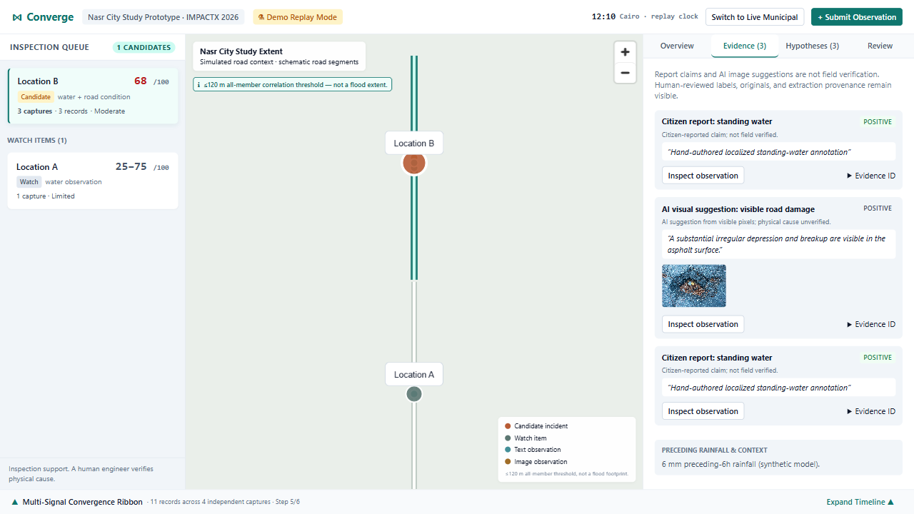
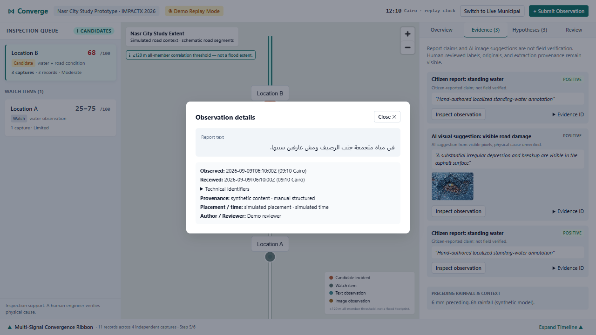
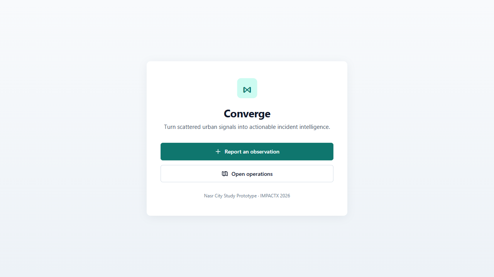
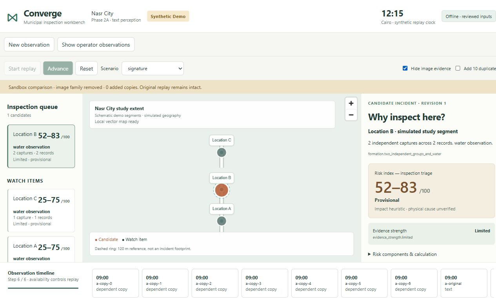

# Converge

### Turn fragmented urban observations into actionable incident intelligence.

Converge is an AI-assisted municipal incident-intelligence and infrastructure early-warning prototype for **IMPACTX 2026 · Smart Cities**.



## The problem

Cities receive many signals about the same place: citizen reports, images, operator observations, maps, and contextual data. Raw report volume is not the same as independent corroboration. Without a way to separate duplicates from genuinely independent captures, teams can miss emerging incidents—or overreact to amplified noise.

## The solution

Converge turns unstructured text and images into traceable evidence, groups observations that are spatially and temporally related, and presents a transparent inspection-triage view for municipal teams. It keeps source provenance visible, distinguishes independent captures from duplicate records, and separates the urgency of a location from the strength of its corroboration.

It is designed for municipalities, governorates, private urban operators, and managed communities. Citizens contribute signals; they are not the paying customer.

Converge is not a generic complaint dashboard, an autonomous government decision-maker, a root-cause diagnosis engine, a failure-probability predictor, or a chatbot.

## How Converge works

```text
Urban observations
        ↓
AI perception and extraction
        ↓
Independence and duplicate handling
        ↓
Spatial + temporal correlation
        ↓
Candidate incident intelligence
        ↓
Risk Index + Evidence Strength + working hypotheses
        ↓
Municipal inspection triage
```



## Product surfaces

| Surface | Purpose |
| --- | --- |
| Signal Capture | Mobile-first text, image, time, and location submission |
| Operations Workbench | Map-based incident queue, evidence, hypotheses, and review |
| Evidence Inspector | Source text, extracted claims, provenance, and human-review context |
| Replay & Audit | A deterministic signature demo for inspecting system behavior |



## Signature demo

The frozen replay demonstrates why independent capture handling matters:

- **Location A:** 8 raw records collapse to 1 independent capture → **Watch**.
- **Location B:** 3 independent captures produce **Risk Index 68** with **Moderate evidence**.
- Hide the image evidence → the result becomes **52–83** with **Limited evidence**.
- Restore the image and add 10 duplicate reports → **13 records**, still **3 independent captures**, still **68 / Moderate**.

Duplicate volume does not inflate the result. The replay is synthetic and demonstrates system behavior; it does not claim that a real incident occurred.



## Risk Index vs Evidence Strength

These are deliberately different signals:

| Measure | Meaning |
| --- | --- |
| **Risk Index** | A transparent prototype heuristic for inspection triage |
| **Evidence Strength** | The degree of independent corroboration available |

**68 is not a 68% probability.** Converge does not predict infrastructure failure or replace engineering inspection.

## AI safety boundary

AI is used for perception: extracting structured claims from unstructured text and identifying visibly supported conditions in images.

Deterministic application code controls incident membership, duplicate and capture independence, Risk Index, Evidence Strength, working hypotheses, and decision-support rules. Human operators make the final operational decisions.

## Architecture

```text
React + TypeScript + Vite  →  FastAPI + Pydantic  →  SQLite
          ↓                         ↓
    MapLibre context       Deterministic correlation/scoring
                                      ↑
                         Hosted pretrained AI perception
```

The application is a responsive React/Vite PWA with a shared FastAPI backend. Geographic context is represented with MapLibre and sourced road data; perception is bounded and server-side; correlation and scoring run locally and deterministically.

## Tech stack

- React, TypeScript, Vite, and MapLibre
- FastAPI, Pydantic, and Python
- SQLite for local persistence
- Hosted pretrained AI for bounded text and image perception
- Deterministic spatial, temporal, evidence, and scoring engine

## Running locally

Requirements: Python 3.11+, Node.js 22.12+, and an optional `OPENAI_API_KEY` for uncached perception.

```powershell
py -3.11 -m venv .venv
.\.venv\Scripts\python.exe -m pip install -r backend\requirements.txt
npm ci --prefix frontend
npm run build --prefix frontend
if (-not (Test-Path -LiteralPath .env)) { Copy-Item .env.example .env }
.\.venv\Scripts\python.exe -m uvicorn backend.app.main:app --host 127.0.0.1 --port 8000
```

Open [http://127.0.0.1:8000](http://127.0.0.1:8000). The bundled replay and cached paths work without a provider request. For frontend development, run `npm run dev --prefix frontend -- --port 5173 --strictPort` in a second terminal.

## Verification

The current frozen release has **129 automated backend tests passing** and browser release checks passing.

```powershell
.\.venv\Scripts\python.exe -m pytest -q
npm run typecheck --prefix frontend
npm run build --prefix frontend
```

These checks validate implementation behavior and reproducibility; they do not establish real-world predictive accuracy.

## Limitations

- Hackathon prototype; no municipal field pilot yet.
- Risk weights and the 120 m spatial threshold are transparent prototype heuristics intended for future real-world calibration.
- Exact and known duplicate handling does not guarantee resistance to coordinated paraphrase or Sybil behavior.
- No production access-control or deployment architecture yet.
- Geography and contextual weather data support the demo but are not a substitute for field verification.

## Team

**Control Alt Elite**

Built for **IMPACTX 2026 · Smart Cities**.
